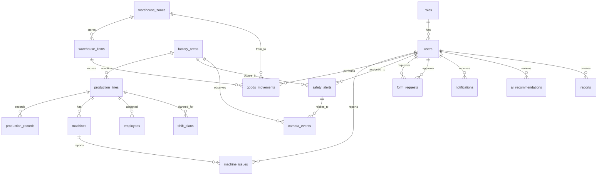

# Smart Factory AI Dashboard Database Design

## 1. Document Purpose

This document describes the database design for the Smart Factory AI Dashboard web application. It is intended to guide C# backend development, database implementation, API mapping, reporting, and future migration from local SQLite to a production-grade relational database.

The database is designed for these web modules:

1. Dashboard overview.
2. Production monitoring.
3. Warehouse management.
4. AI camera and safety monitoring.
5. Workforce planning.
6. Electronic forms.
7. Notifications.
8. Reports.
9. AI recommendations.

## 2. Current Database Assets

Current database-related files:

```text
backend-dotnet/database/schema.sql
backend-dotnet/database/seed.sql
backend-dotnet/database/sample-data.json
backend-dotnet/database/README.md
```

Current backend data flow:

```text
SQLite smart_factory_demo.db -> SampleDataService -> MVC Controllers -> React frontend
                 \-> JSON fallback sample-data.json when SQLite is unavailable
```

Current backend project:

```text
backend-dotnet/
```

The C# backend uses SQLite as the primary local data source. If the database file is missing, the backend creates it from `schema.sql` and `seed.sql`. If SQLite cannot be opened or queried, the backend falls back to `sample-data.json` so the frontend can still run with test data.

## 3. Recommended Database Engine

### 3.1 MVP / Local Demo

Use SQLite for local demo and fast development.

Reason:

1. No server setup required.
2. Easy to seed with `schema.sql` and `seed.sql`.
3. Suitable for demo and UI development.
4. Works well with C# using `Microsoft.Data.Sqlite`.

### 3.2 Production-like Environment

Use PostgreSQL when the application needs:

1. Multi-user writes.
2. Stronger reporting queries.
3. Better indexing and concurrency.
4. Deployment to real factory environments.
5. Integration with BI tools or external systems.

## 4. Entity Relationship Overview

For the detailed ERD with all keys and references, see:

```text
docs/database/smart-factory-ai-dashboard-database-erd.md
docs/database/smart-factory-ai-dashboard-database-erd.html
```



## 5. Core Tables

### 5.1 `roles`

Stores user role definitions.

Main fields:

| Field | Type | Description |
|---|---|---|
| `id` | TEXT | Primary key. Example: `role-factory-manager`. |
| `name` | TEXT | Unique role name. |
| `description` | TEXT | Role responsibility summary. |

Used by:

1. Login and authorization later.
2. User permission checks.
3. Menu visibility by role.

### 5.2 `users`

Stores system users and department ownership.

Main fields:

| Field | Type | Description |
|---|---|---|
| `id` | TEXT | Primary key. |
| `full_name` | TEXT | User display name. |
| `email` | TEXT | Unique email. |
| `role_id` | TEXT | Foreign key to `roles.id`. |
| `department` | TEXT | Operations, Production, Warehouse, Safety, etc. |
| `status` | TEXT | Active, Inactive, Suspended. |
| `created_at` | TEXT | ISO datetime. |

Used by:

1. Forms requester and approver.
2. Safety alert assignment.
3. Notification target user.
4. Report author.
5. AI recommendation reviewer.

### 5.3 `factory_areas`

Stores physical or logical areas in the factory.

Main fields:

| Field | Type | Description |
|---|---|---|
| `id` | TEXT | Primary key. |
| `name` | TEXT | Area display name. |
| `area_type` | TEXT | Production, Warehouse, Safety. |
| `risk_level` | TEXT | Low, Medium, High, Critical. |
| `description` | TEXT | Area details. |

Used by:

1. Production line location.
2. Safety alert location.
3. Camera event location.
4. Risk map on the Safety page.

## 6. Production Module Tables

### 6.1 `production_lines`

Stores current status and daily summary of each production line.

Main fields:

| Field | Type | Description |
|---|---|---|
| `id` | TEXT | Primary key. |
| `name` | TEXT | Line name, such as `Line A`. |
| `area_id` | TEXT | Foreign key to `factory_areas.id`. |
| `status` | TEXT | Normal, Warning, Stopped, Maintenance. |
| `target_output` | INTEGER | Planned output for the day or shift. |
| `actual_output` | INTEGER | Current completed output. |
| `efficiency` | INTEGER | Efficiency percentage. |
| `defect_rate` | REAL | Defect rate percentage. |
| `downtime_minutes` | INTEGER | Downtime today or this shift. |
| `assigned_workers` | INTEGER | Number of workers assigned. |
| `issue` | TEXT | Current issue summary. |

Used by:

1. Dashboard line performance.
2. Production page table.
3. Analytics efficiency bars.
4. Workforce planning.
5. Reports.

### 6.2 `production_records`

Stores time-series production measurements.

Main fields:

| Field | Type | Description |
|---|---|---|
| `id` | TEXT | Primary key. |
| `line_id` | TEXT | Foreign key to `production_lines.id`. |
| `record_time` | TEXT | ISO datetime of measurement. |
| `target_output` | INTEGER | Target for this interval. |
| `actual_output` | INTEGER | Actual output for this interval. |
| `defect_count` | INTEGER | Defects in this interval. |
| `downtime_minutes` | INTEGER | Downtime in this interval. |

Used by:

1. Charts.
2. Trend analysis.
3. Reports.
4. Future AI prediction.

### 6.3 `machines`

Stores machine inventory and line assignment.

Main fields:

| Field | Type | Description |
|---|---|---|
| `id` | TEXT | Primary key. |
| `machine_code` | TEXT | Unique machine code. |
| `name` | TEXT | Machine display name. |
| `line_id` | TEXT | Foreign key to `production_lines.id`. |
| `status` | TEXT | Running, Warning, Stopped, Maintenance. |
| `last_maintenance_at` | TEXT | Last maintenance datetime. |

Used by:

1. Machine issue reports.
2. Downtime root-cause analysis.
3. Maintenance planning later.

### 6.4 `machine_issues`

Stores reported machine problems.

Main fields:

| Field | Type | Description |
|---|---|---|
| `id` | TEXT | Primary key. |
| `machine_id` | TEXT | Foreign key to `machines.id`. |
| `line_id` | TEXT | Foreign key to `production_lines.id`. |
| `severity` | TEXT | Low, Medium, High, Critical. |
| `status` | TEXT | Submitted, In Review, Resolved, Escalated. |
| `description` | TEXT | Issue details. |
| `reported_by` | TEXT | Foreign key to `users.id`. |
| `reported_at` | TEXT | ISO datetime. |

Used by:

1. Forms module.
2. Production issue tracking.
3. AI recommendations.

## 7. Warehouse Module Tables

### 7.1 `warehouse_zones`

Stores warehouse locations and capacity status.

Main fields:

| Field | Type | Description |
|---|---|---|
| `id` | TEXT | Primary key. |
| `name` | TEXT | Zone display name. |
| `zone_type` | TEXT | Raw Material, Finished Goods, Packaging, Temperature Sensitive. |
| `capacity` | INTEGER | Zone capacity. |
| `current_usage` | INTEGER | Current usage count. |
| `status` | TEXT | Available, Near Capacity, Warning. |

Used by:

1. Warehouse occupancy cards.
2. Item location tracking.
3. Wrong placement detection.

### 7.2 `warehouse_items`

Stores item, batch, IO, BU, and current location information.

Main fields:

| Field | Type | Description |
|---|---|---|
| `id` | TEXT | Primary key. |
| `io_id` | TEXT | IO ID from warehouse/business data. Example: `4229`. |
| `io_code` | TEXT | IO code. Example: `TC2`. |
| `bu` | TEXT | Business unit. Example: `Ryobi`, `AES`, `MIL`. |
| `item_code` | TEXT | Unique item code used by the app. |
| `item_name` | TEXT | Item display name. |
| `batch_code` | TEXT | Batch or lot code. |
| `category` | TEXT | Raw Material, Component, Finished Goods, Packaging. |
| `quantity` | INTEGER | Current quantity. |
| `unit` | TEXT | Unit such as pcs, kits, sheets, sets. |
| `zone_id` | TEXT | Foreign key to `warehouse_zones.id`. |
| `shelf` | TEXT | Shelf or bin code. |
| `status` | TEXT | Correct, Wrong Zone, Low Stock, Over Capacity. |
| `last_movement_at` | TEXT | Last movement datetime. |

Current BU and IO mapping:

| IO ID | IO Code | BU |
|---|---|---|
| `4229` | `TC2` | Ryobi |
| `4070` | `TC5` | Ryobi |
| `4506` | `TN2` | Ryobi |
| `3615` | `TN5` | Ryobi |
| `4073` | `TCB` | AES |
| `4530` | `TD3` | MIL |
| `4327` | `TH3` | MIL |
| `4226` | `TP7` | MIL |

Used by:

1. Warehouse table.
2. Dashboard warehouse signals.
3. Warehouse search by BU, IO ID, IO code, item code, item name, or batch.
4. Reports.
5. Inventory movement history.

### 7.3 `goods_movements`

Stores item movement history.

Main fields:

| Field | Type | Description |
|---|---|---|
| `id` | TEXT | Primary key. |
| `item_id` | TEXT | Foreign key to `warehouse_items.id`. |
| `from_zone_id` | TEXT | Previous zone, nullable for import. |
| `to_zone_id` | TEXT | New zone. |
| `quantity` | INTEGER | Moved quantity. |
| `movement_type` | TEXT | Import, Export, Transfer, Correction. |
| `moved_by` | TEXT | Foreign key to `users.id`. |
| `moved_at` | TEXT | ISO datetime. |
| `note` | TEXT | Movement reason or comment. |

Used by:

1. Item movement timeline.
2. Audit history.
3. Warehouse reports.
4. Wrong placement resolution.

## 8. Safety And Camera Tables

### 8.1 `safety_alerts`

Stores safety events detected by users, sensors, or AI camera logic.

Main fields:

| Field | Type | Description |
|---|---|---|
| `id` | TEXT | Primary key. |
| `title` | TEXT | Alert title. |
| `alert_type` | TEXT | AI Camera, Sensor, Traffic. |
| `severity` | TEXT | Low, Medium, High, Critical. |
| `area_id` | TEXT | Foreign key to `factory_areas.id`. |
| `status` | TEXT | New, In Review, Resolved, Escalated, False Alert. |
| `detected_at` | TEXT | Detection datetime. |
| `assigned_to` | TEXT | Foreign key to `users.id`. |
| `description` | TEXT | Alert details. |
| `action_note` | TEXT | Resolution or escalation note. |

Used by:

1. Safety page.
2. Dashboard priority alerts.
3. Notifications.
4. Safety reports.

### 8.2 `camera_events`

Stores AI camera detections.

Main fields:

| Field | Type | Description |
|---|---|---|
| `id` | TEXT | Primary key. |
| `camera_code` | TEXT | Camera identifier. |
| `area_id` | TEXT | Foreign key to `factory_areas.id`. |
| `event_type` | TEXT | Restricted Zone Entry, Traffic Congestion, etc. |
| `severity` | TEXT | Low, Medium, High, Critical. |
| `confidence` | REAL | AI confidence score from 0 to 1. |
| `event_time` | TEXT | Detection datetime. |
| `related_alert_id` | TEXT | Optional foreign key to `safety_alerts.id`. |

Used by:

1. Cameras page event log.
2. Safety alert creation.
3. AI detection audit.

## 9. Workforce Tables

### 9.1 `employees`

Stores employee availability and skills.

Main fields:

| Field | Type | Description |
|---|---|---|
| `id` | TEXT | Primary key. |
| `employee_code` | TEXT | Unique employee code. |
| `full_name` | TEXT | Employee name. |
| `department` | TEXT | Production, Quality, Warehouse, etc. |
| `skill_tags` | TEXT | Comma-separated skill tags in MVP. |
| `availability_status` | TEXT | Available, Busy, Leave, Unavailable. |
| `current_line_id` | TEXT | Optional foreign key to `production_lines.id`. |

Used by:

1. Workforce planning.
2. AI shift recommendation.
3. Coverage calculation.

### 9.2 `shift_plans`

Stores planned staffing by line and shift.

Main fields:

| Field | Type | Description |
|---|---|---|
| `id` | TEXT | Primary key. |
| `shift_date` | TEXT | Shift date. |
| `shift_name` | TEXT | Morning, Afternoon, Night. |
| `line_id` | TEXT | Foreign key to `production_lines.id`. |
| `required_workers` | INTEGER | Required workers. |
| `assigned_workers` | INTEGER | Assigned workers. |
| `overtime_hours` | REAL | Suggested or approved overtime. |
| `status` | TEXT | Draft, Recommended, Published. |

Used by:

1. Workforce page.
2. Dashboard recommendations.
3. Overtime form generation.

## 10. Workflow Tables

### 10.1 `form_requests`

Stores electronic operational forms.

Main fields:

| Field | Type | Description |
|---|---|---|
| `id` | TEXT | Primary key. |
| `form_type` | TEXT | Overtime Request, Machine Issue Report, Warehouse Export. |
| `requester_id` | TEXT | Foreign key to `users.id`. |
| `approver_id` | TEXT | Foreign key to `users.id`. |
| `status` | TEXT | Draft, Pending Approval, Approved, Rejected, Cancelled. |
| `submitted_at` | TEXT | Submit datetime. |
| `approved_at` | TEXT | Approval datetime. |
| `summary` | TEXT | Short form content. |
| `rejection_reason` | TEXT | Reason if rejected. |

Used by:

1. Forms page.
2. Dashboard pending approvals.
3. Notifications.

### 10.2 `notifications`

Stores notification records for users.

Main fields:

| Field | Type | Description |
|---|---|---|
| `id` | TEXT | Primary key. |
| `title` | TEXT | Notification title. |
| `notification_type` | TEXT | Safety, Production, Warehouse, Forms. |
| `severity` | TEXT | Low, Medium, High, Critical. |
| `status` | TEXT | Unread, Read, Resolved. |
| `target_user_id` | TEXT | Foreign key to `users.id`. |
| `related_entity_type` | TEXT | SafetyAlert, ProductionLine, FormRequest, WarehouseItem. |
| `related_entity_id` | TEXT | ID of the related entity. |
| `created_at` | TEXT | Creation datetime. |

Used by:

1. Notifications page.
2. Topbar unread badge later.
3. Workflow follow-up.

## 11. AI And Reporting Tables

### 11.1 `ai_recommendations`

Stores rule-based or AI-generated suggestions.

Main fields:

| Field | Type | Description |
|---|---|---|
| `id` | TEXT | Primary key. |
| `module` | TEXT | Workforce, Production, Warehouse, Safety. |
| `title` | TEXT | Recommendation title. |
| `reason` | TEXT | Why the recommendation was generated. |
| `expected_impact` | TEXT | Expected operational impact. |
| `status` | TEXT | New, Reviewed, Applied, Modified, Rejected. |
| `created_at` | TEXT | Creation datetime. |
| `reviewed_by` | TEXT | Optional foreign key to `users.id`. |

Used by:

1. Dashboard AI panel.
2. Workforce recommendations.
3. Future recommendation review workflow.

### 11.2 `reports`

Stores generated report snapshots.

Main fields:

| Field | Type | Description |
|---|---|---|
| `id` | TEXT | Primary key. |
| `report_type` | TEXT | Production, Warehouse, Safety, Workforce, Forms. |
| `title` | TEXT | Report title. |
| `period_start` | TEXT | Report start datetime. |
| `period_end` | TEXT | Report end datetime. |
| `summary` | TEXT | Report summary. |
| `created_by` | TEXT | Foreign key to `users.id`. |
| `created_at` | TEXT | Creation datetime. |

Used by:

1. Reports page.
2. Export PDF/Excel later.
3. Historical summary.

## 12. API To Table Mapping

## 12. Enterprise Link Tables

The schema now includes an enterprise-style relationship layer. These tables make many-to-many relationships explicit and keep the core business tables cleaner.

### 12.1 Identity And Permission Links

| Table | Purpose | Main References |
|---|---|---|
| `permissions` | Defines module-level permissions such as dashboard view, warehouse manage, forms approve. | None |
| `role_permissions` | Connects roles to permissions. One role can have many permissions, and one permission can belong to many roles. | `roles.id`, `permissions.id` |

### 12.2 Warehouse BU And IO Links

| Table | Purpose | Main References |
|---|---|---|
| `business_units` | Master table for BU values such as Ryobi, AES, MIL. | None |
| `io_masters` | Master table for IO ID and IO Code, assigned to a BU. | `business_units.id` |
| `warehouse_item_io_links` | Connects warehouse items to IO master records. Supports future cases where one item can be linked to multiple IO records over time. | `warehouse_items.id`, `io_masters.id` |

### 12.3 Workforce Assignment Links

| Table | Purpose | Main References |
|---|---|---|
| `skills` | Master table for skill definitions. | None |
| `employee_skills` | Connects employees to skills and stores proficiency/certification. | `employees.id`, `skills.id` |
| `shift_plan_assignments` | Connects shift plans to assigned employees. | `shift_plans.id`, `employees.id` |

### 12.4 Safety Evidence Links

| Table | Purpose | Main References |
|---|---|---|
| `safety_alert_camera_events` | Connects safety alerts to camera events. Supports multiple camera evidence records per alert. | `safety_alerts.id`, `camera_events.id` |

### 12.5 Workflow And Traceability Links

| Table | Purpose | Main References |
|---|---|---|
| `form_approval_steps` | Stores multi-step approval workflow for a form request. | `form_requests.id`, `users.id` |
| `notification_links` | Links one notification to one or more business entities. | `notifications.id` plus logical entity reference |
| `ai_recommendation_links` | Links AI recommendations to affected business entities. | `ai_recommendations.id` plus logical entity reference |
| `report_source_links` | Links reports to the source entities included in the report snapshot. | `reports.id` plus logical source reference |

These link tables are intentionally additive. The current frontend can continue reading the existing response DTOs, while the backend can gradually move toward richer joins and repository queries.

## 13. API To Table Mapping

| API Endpoint | Controller | Main Tables |
|---|---|---|
| `GET /health` | `HealthController` | None |
| `GET /dashboard/summary` | `DashboardController` | `production_lines`, `safety_alerts`, `warehouse_items`, `form_requests`, `ai_recommendations` |
| `GET /dashboard/kpis` | `DashboardController` | `production_lines`, `safety_alerts` |
| `GET /production/lines` | `ProductionController` | `production_lines`, `factory_areas` |
| `GET /warehouse/items` | `WarehouseController` | `warehouse_items`, `warehouse_zones`, `warehouse_item_io_links`, `io_masters`, `business_units` |
| `GET /safety/alerts` | `SafetyController` | `safety_alerts`, `factory_areas`, `users` |
| `GET /cameras/events` | `CamerasController` | `camera_events`, `factory_areas`, `safety_alert_camera_events`, `safety_alerts` |
| `GET /workforce/shifts` | `WorkforceController` | `shift_plans`, `shift_plan_assignments`, `employees`, `production_lines` |
| `GET /workforce/recommendations` | `WorkforceController` | `ai_recommendations`, `ai_recommendation_links` |
| `GET /forms` | `FormsController` | `form_requests`, `form_approval_steps`, `users` |
| `GET /notifications` | `NotificationsController` | `notifications`, `notification_links`, `users` |
| `GET /reports/*` | `ReportsController` | `reports`, `report_source_links` plus module tables |

## 14. Suggested Indexes

For SQLite or PostgreSQL, add indexes when moving beyond sample data.

Recommended indexes:

```sql
CREATE INDEX idx_users_role_id ON users(role_id);
CREATE INDEX idx_production_lines_area_id ON production_lines(area_id);
CREATE INDEX idx_production_records_line_time ON production_records(line_id, record_time);
CREATE INDEX idx_machines_line_id ON machines(line_id);
CREATE INDEX idx_machine_issues_line_status ON machine_issues(line_id, status);
CREATE INDEX idx_warehouse_items_io ON warehouse_items(io_id, io_code, bu);
CREATE INDEX idx_warehouse_items_zone_status ON warehouse_items(zone_id, status);
CREATE INDEX idx_goods_movements_item_time ON goods_movements(item_id, moved_at);
CREATE INDEX idx_safety_alerts_area_status ON safety_alerts(area_id, status);
CREATE INDEX idx_camera_events_area_time ON camera_events(area_id, event_time);
CREATE INDEX idx_shift_plans_date_line ON shift_plans(shift_date, line_id);
CREATE INDEX idx_form_requests_status ON form_requests(status);
CREATE INDEX idx_notifications_user_status ON notifications(target_user_id, status);
CREATE INDEX idx_ai_recommendations_module_status ON ai_recommendations(module, status);
CREATE INDEX idx_reports_type_period ON reports(report_type, period_start, period_end);
CREATE INDEX idx_role_permissions_permission ON role_permissions(permission_id);
CREATE INDEX idx_io_masters_bu ON io_masters(bu_id);
CREATE INDEX idx_warehouse_item_io_links_io ON warehouse_item_io_links(io_master_id);
CREATE INDEX idx_employee_skills_skill ON employee_skills(skill_id);
CREATE INDEX idx_shift_plan_assignments_employee ON shift_plan_assignments(employee_id);
CREATE INDEX idx_safety_alert_camera_events_camera ON safety_alert_camera_events(camera_event_id);
CREATE INDEX idx_form_approval_steps_form_order ON form_approval_steps(form_id, step_order);
CREATE INDEX idx_notification_links_entity ON notification_links(entity_type, entity_id);
CREATE INDEX idx_ai_recommendation_links_entity ON ai_recommendation_links(entity_type, entity_id);
CREATE INDEX idx_report_source_links_source ON report_source_links(source_type, source_id);
```

## 15. Data Rules And Validation

### 15.1 Status Values

Recommended controlled values:

| Domain | Values |
|---|---|
| Production line status | Normal, Warning, Stopped, Maintenance |
| Severity | Low, Medium, High, Critical |
| Warehouse item status | Correct, Wrong Zone, Low Stock, Over Capacity |
| Form status | Draft, Pending Approval, Approved, Rejected, Cancelled |
| Notification status | Unread, Read, Resolved |
| Shift plan status | Draft, Recommended, Published |
| AI recommendation status | New, Reviewed, Applied, Modified, Rejected |

### 15.2 Warehouse Rules

1. `warehouse_items.item_code` must be unique.
2. `io_id`, `io_code`, and `bu` are required for Warehouse item records.
3. `quantity` must be greater than or equal to 0.
4. `zone_id` must exist in `warehouse_zones`.
5. `status = Wrong Zone` should create or link to a warehouse notification.
6. `status = Low Stock` should create or link to a warehouse notification when quantity is below threshold.

### 15.3 Production Rules

1. `actual_output` should not be negative.
2. `target_output` should be greater than 0 for active lines.
3. `efficiency` should be between 0 and 100.
4. `defect_rate` should be between 0 and 100.
5. `status = Stopped` should usually have downtime greater than 0.

### 15.4 Safety Rules

1. Critical safety alerts must have an assigned user.
2. Camera events with critical severity should create a linked safety alert.
3. Resolved alerts should keep `action_note` for audit.

## 16. Future Improvements

### 16.1 Normalize Skills

Current MVP keeps `employees.skill_tags` for simple display, but the enterprise schema now includes normalized skill tables:

```text
skills
employee_skills
```

### 16.2 Normalize Notification Relations

Current MVP keeps `notifications.related_entity_type` and `notifications.related_entity_id` for simple display, while `notification_links` provides a cleaner enterprise traceability layer.

### 16.3 Add Audit Logs

Add an audit table for changes to forms, safety alerts, warehouse movements, and AI recommendation decisions.

Suggested table:

```text
audit_logs(id, entity_type, entity_id, action, old_value, new_value, changed_by, changed_at)
```

### 16.4 Add Threshold Configuration

Add configuration tables for:

1. Low stock thresholds.
2. Zone capacity warning thresholds.
3. Production efficiency warning thresholds.
4. Safety escalation thresholds.

Suggested table:

```text
alert_rules(id, module, rule_key, threshold_value, severity, is_active)
```

## 17. Implementation Priority

Recommended database implementation order:

1. Keep SQLite-first loading active in the C# backend.
2. Keep JSON fallback available for demos and broken/missing DB cases.
3. Move SQL queries out of `SampleDataService` into repository classes by module.
4. Add repositories for Production, Warehouse, Safety, Workforce, Forms, Notifications, Reports.
5. Add create/update endpoints for forms, alert actions, notification read status, and warehouse movement.
6. Add indexes after real query patterns are stable.
7. Move from SQLite to PostgreSQL if deployment requires multi-user write performance.

## 18. Recommended Backend Repository Structure

When moving beyond the current `SampleDataService` implementation, use this backend structure:

```text
backend-dotnet/
  Controllers/
  Models/
    Database/
    Dtos/
    Requests/
  Data/
    DbConnectionFactory.cs
  Repositories/
    IWarehouseRepository.cs
    WarehouseRepository.cs
    IProductionRepository.cs
    ProductionRepository.cs
  Services/
    WarehouseService.cs
    ProductionService.cs
    DashboardService.cs
```

  For the current phase, `SampleDataService` is acceptable because it already handles SQLite-first loading and JSON fallback. The next cleanup step is to move module-specific SQL into repositories.